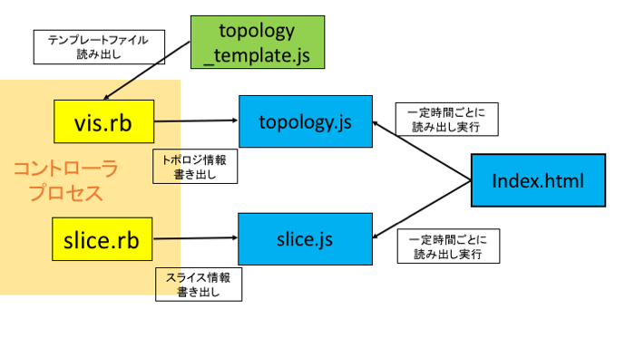
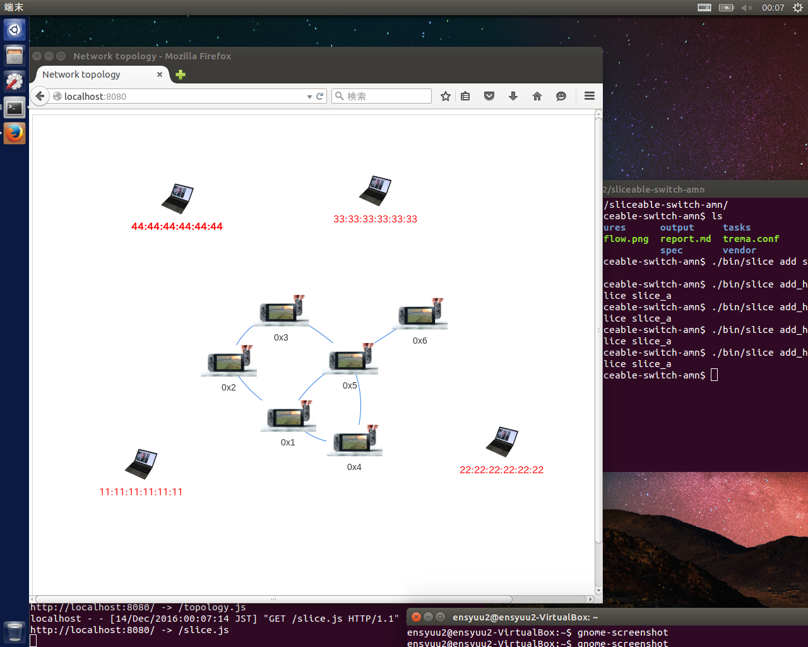
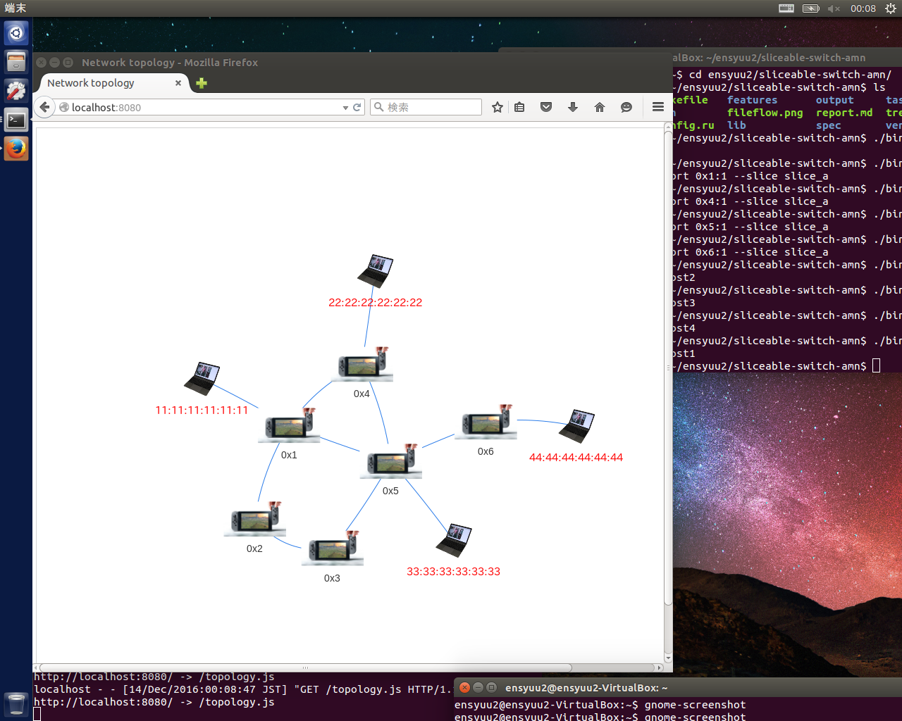
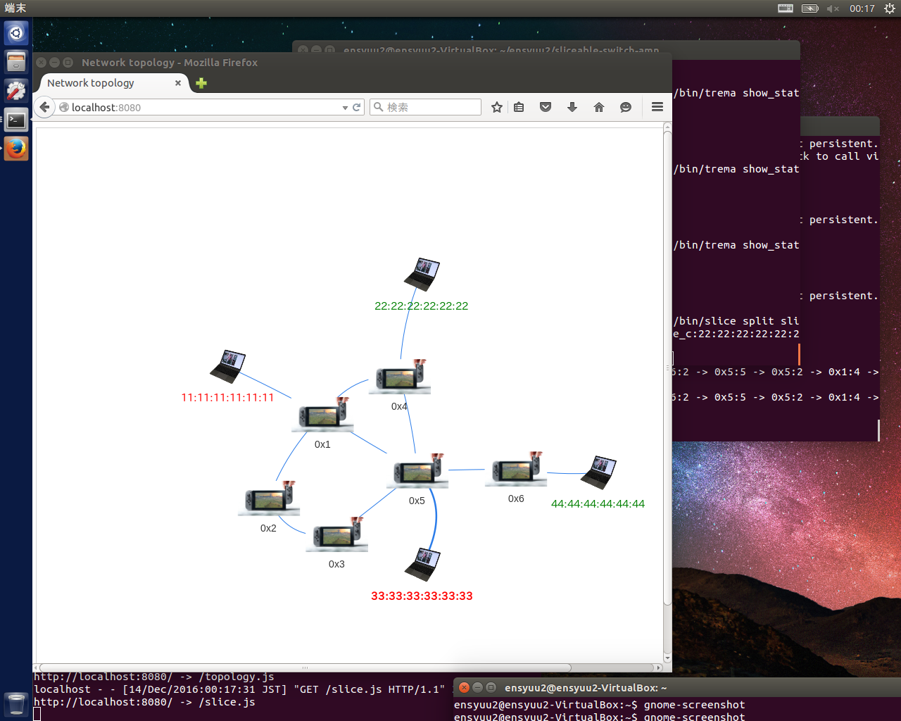
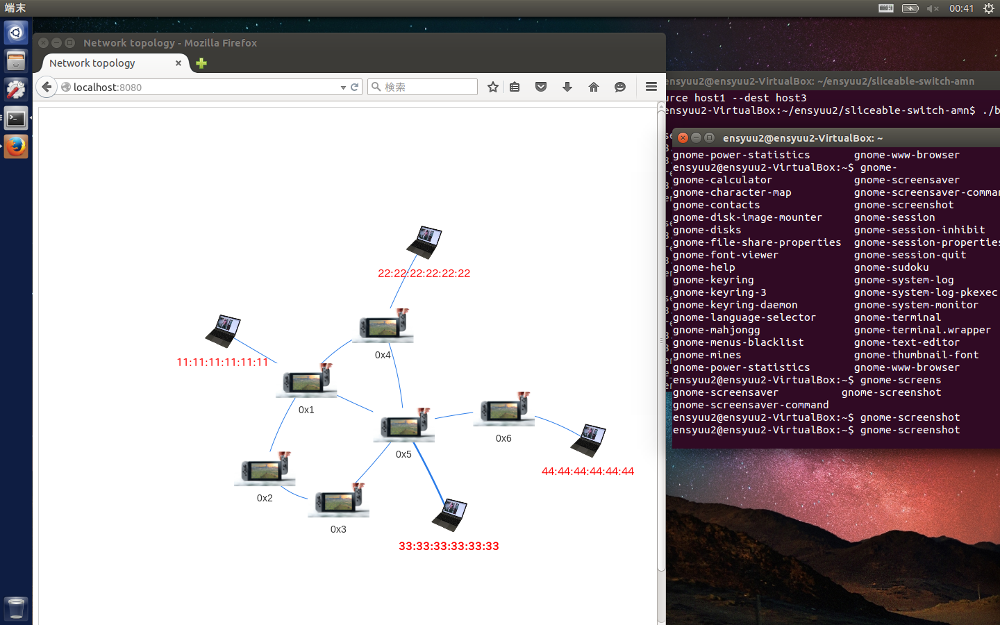
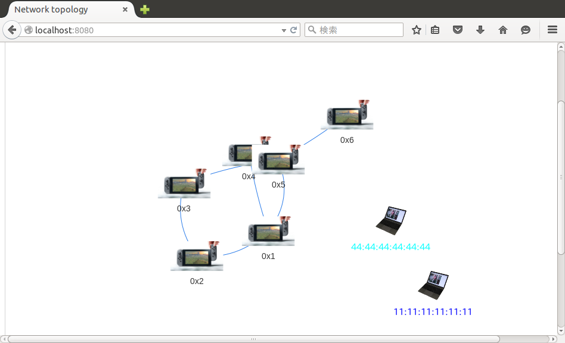
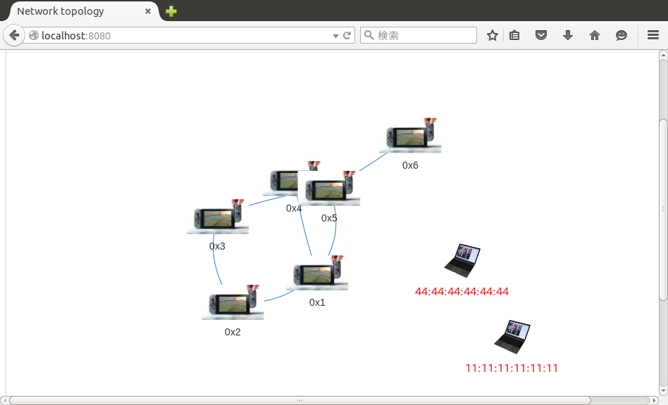
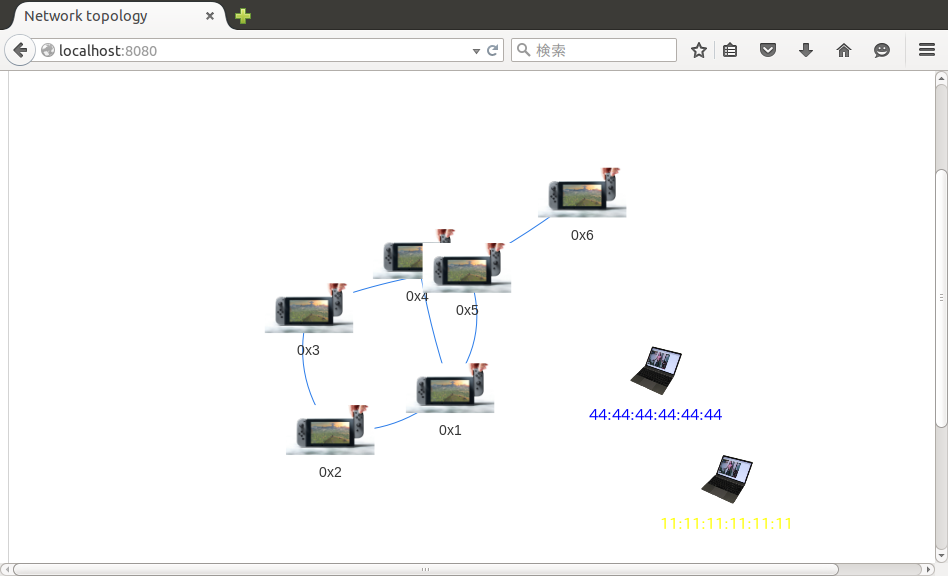

# 第8回 (11/30)レポート(team-amn:東野研)
### メンバー
* 今井 友揮
* 成元 椋祐
* 西村 友佑
* 原 佑輔
* 三浦 太樹

## 1. スライスの分割・結合
### 1.1 コマンドの仕様
　スライスの分割ではサブコマンド`split`を定義した．
[講義資料](http://handai-trema.github.io/deck/week8/sliceable_switch.pdf)を参考に、スライスに属する各ホストの指定にはMACアドレスを用いるものとして、サブコマンドの仕様を定義した．
　host1(MACアドレス: 11:11:11:11:11:11)・host2(22:22:22:22:22)・host3(33:33:33:33:33:33)・host4(44:44:44:44:44:44)が属するslice_aを、host1・host2が属するslice_bと、host3・host4が属するslice_cに分割する際は以下のようにコマンドを実行する．
```
./bin/slice split slice_a --into slice_b:11:11:11:11:11:11, 22:22:22:22:22:22 slice_c:33:33:33:33:33:33, 44:44:44:44:44:44
```

　スライスを分割する際に、分割元のスライスに属する全てのホストを分割先のスライスに割り当てなかった場合、分割元のスライスは残す仕様とした．

　スライスの結合ではサブコマンド`join`を定義した．
コマンドの仕様は、引数として結合元のスライスをスペースで区切って指定し、結合後の新たなスライス名を`--into`オプションで指定するものとした．
２つのスライスslice_aとslice_bを結合し、新たにslice_cを作成する際のコマンド例は以下となる．

```
./bin/slice join slice_a slice_b --into slice_c
```

### 1.2 実装内容
 　スライスの分割・結合を実装するにあたって修正、作成した主なファイルについて説明する．
* /bin/slice
 * スライスの分割・結合を実行する際のコマンドを定義
* /lib/slice.rb
 * スライスの分割・結合を行うメソッドとしてsplitとjoinを追加

## 2. スライスの可視化
### 2.1 使用方法
　/output/index.htmlによって表示されるトポロジ図において、ホストの属するスライスの情報を重ねて表示する．index.htmlでは、トポロジ図におけるホストのラベルとして出力されるMACアドレスの文字の色をスライスごとに異なる色で表示される．  
　index.htmlは1秒間隔で更新されるが、表示間隔の更新にはタイムスタンプの取得が必要である．事前準備として/output/server.shを起動する必要がある．

### 2.2 ファイルの呼び出し関係図
　以下にファイルを介して行っているコントローラプロセス~ブラウザ間のトポロジ情報，スライス情報のやり取りの関係を図で示す．



### 2.3 実装内容
* /lib/slice.rb
 * スライスの出力ファイルslice.jsを出力するメソッドwrite_slice_infoを追加．このメソッドでは、Sliceクラスのクラス変数allを参照し、スライスごとに生成されるSliceクラスのインスタンスから、そのスライスに属するホストのmacアドレスを取得し、スライスの情報をノードのラベルの色情報として付加してslice.jsに出力している．


## 3. REST APIの追加
### 3.1 実装内容
スライスの分割・統合を行う機能を持つREST APIを追加するために，以下の通り ```lib/rest_api.rb```に，分割を行う```Split a slice.```，統合を行う```Join a slice.``` から始まるブロックをそれぞれ追加した．

```
  desc 'Split a slice.'
  params do
    requires :base_slice_id, type: String, desc: 'Base slice.'
    requires :into_slices_id, type: String, desc: 'Into slices(multiple).'
  end
  get 'base_slice_id/:base_slice_id/into_slices_id/:into_slices_id' do
    rest_api do
      arr = params[:into_slices_id].split(",")
      Slice.split(params[:base_slice_id], arr[0],arr[1])
    end
  end
```
```
  desc 'Join a slice.'
  params do
    requires :base_slices_id, type: String, desc: 'Base slices(multiple).'
    requires :into_slice_id, type: String, desc: 'Into slice.'
  end
  get 'base_slices_id/:base_slices_id/into_slice_id/:into_slice_id' do
    rest_api do
      Slice.join(params[:base_slices_id].split(","), params[:into_slice_id])
    end
  end
```

既に実装されていたものを参考にしてこれらを実装した．```Slice```クラスにおいて定義した，スライスの分割を行うための```split```メソッド，スライスの統合を行うための```join```メソッドをそれぞれ呼び出す処理を行う．  
以下にスライスの分割，統合それぞれのコマンドについての簡素な説明を示す．

###①分割
第１入力引数に分割されるスライスIDである```base_slice_id```，第２入力引数に分割後のそれぞれのスライスIDである```into_slices_id```を入力することで，REST APIによるスライスの分割機能を実現する．このとき，第２引数には```,```区切りで分割先のスライスIDを入力する必要がある．  
以下に分割機能のコマンドの使い方の例を示す．  
```curl -sS -X GET 'http://localhost:9292/base_slice_id/slice_a/into_slices_id/slice_b,slice_c'```

###②統合
第１入力引数に統合したいスライス（複数）を```,```で区切ったID，第２入力引数に統合後に新たに生成されるスライスIDを入力することで，REST APIによるスライスの統合機能を実現する．  
以下に統合機能のコマンドの使い方の例を示す．  
```curl -sS -X GET 'http://localhost:9292/base_slices_id/slice_a,slice_b/into_slice_id/slice_c'```


## 4. 仮想ネットワークでの動作検証
### 4.1 スライスの分割・結合
　./trema.confでのネットワークトポロージを使用し、仮想ネットワークにおいて動作を検証した．コントローラを起動後、コマンドライン上でスライスを定義した上で、スライスの分割・結合を行い、ブラウザ上で表示されるトポロジ図を確認した．
#### STEP.1 スライスの作成
スライスの作成のために以下のコマンドを実行した．

```
$ ./bin/slice add slice_a
$ ./bin/slice add_host --mac 11:11:11:11:11:11 --port 0x1:1 --slice slice_a
$ ./bin/slice add_host --mac 22:22:22:22:22:22 --port 0x4:1 --slice slice_a
$ ./bin/slice add_host --mac 33:33:33:33:33:33 --port 0x5:1 --slice slice_a
$ ./bin/slice add_host --mac 44:44:44:44:44:44 --port 0x6:1 --slice slice_a
```


しかし，このままではホストの位置をコントローラが把握することが出来ないために以下のようにパケットを送信することで，各ホストの位置を検出できる．

```
$ ./bin/trema send_packets --source host1 --dest host2
$ ./bin/trema send_packets --source host2 --dest host3
$ ./bin/trema send_packets --source host3 --dest host4
$ ./bin/trema send_packets --source host4 --dest host1
```
以下にホストの接続状況が把握できた時のトポロジ情報を示す．

また，この時の各ホストのパケット送受信の状況を以下に示す．

```
$ ./bin/trema show_stats host1
Packets sent:
  192.168.0.1 -> 192.168.0.2 = 1 packet
Packets received:
  192.168.0.4 -> 192.168.0.1 = 1 packet
$ ./bin/trema show_stats host2
Packets sent:
  192.168.0.2 -> 192.168.0.3 = 1 packet
Packets received:
  192.168.0.1 -> 192.168.0.2 = 1 packet
$ ./bin/trema show_stats host3
Packets sent:
  192.168.0.3 -> 192.168.0.4 = 1 packet
Packets received:
  192.168.0.2 -> 192.168.0.3 = 1 packet
$ ./bin/trema show_stats host4
Packets sent:
  192.168.0.4 -> 192.168.0.1 = 1 packet
Packets received:
  192.168.0.3 -> 192.168.0.4 = 1 packet
```

#### STEP.2 スライスの分割
スライスの分割を以下のコマンドで実行した．

```
$ ./bin/slice split slice_a --into slice_b:11:11:11:11:11:11,33:33:33:33:33:33 slice_c:22:22:22:22:22:22,44:44:44:44:44:44
$ ./bin/slice list
slice_b
  0x1:1
    11:11:11:11:11:11
  0x5:1
    33:33:33:33:33:33
slice_c
  0x4:1
    22:22:22:22:22:22
  0x6:1
    44:44:44:44:44:44
```

スライスのlistコマンドでスライスが分割出来ていることができる．
また，以下にブラウザ上でのスライスの状況を示す．スライスが分割でき，スライスごとに色分けされていることが分かる．



#### STEP.3 パケットの送信
host1とhost3をslice\_bにhost2とhost4をslice\_cに分割したので，host1とhost2，また，host3とhost4同士はパケットの送受信ができない．これを以下のコマンドで確認する．

```
$ ./bin/trema send_packets --source host1 --dest host2
$ ./bin/trema send_packets --source host1 --dest host3
$ ./bin/trema show_stats host1
Packets sent:
  192.168.0.1 -> 192.168.0.2 = 2 packets
  192.168.0.1 -> 192.168.0.3 = 1 packet
Packets received:
  192.168.0.4 -> 192.168.0.1 = 1 packet
$ ./bin/trema show_stats host2
Packets sent:
  192.168.0.2 -> 192.168.0.3 = 1 packet
Packets received:
  192.168.0.1 -> 192.168.0.2 = 1 packet
 ./bin/trema show_stats host3
Packets sent:
  192.168.0.3 -> 192.168.0.4 = 1 packet
Packets received:
  192.168.0.2 -> 192.168.0.3 = 1 packet
  192.168.0.1 -> 192.168.0.3 = 1 packet
```
このようにhost1とhost2，また，host3とhost4同士はパケットの送受信ができないので，ネットワークのスライスが正しく行えていることが確認できた．

#### STEP.4 スライスの結合
スライスの結合と確認を以下のコマンドで実行した．

```
$ ./bin/slice join slice_b slice_c --into slice_a
$ ./bin/slice list
slice_a
  0x1:1
    11:11:11:11:11:11
  0x5:1
    33:33:33:33:33:33
  0x4:1
    22:22:22:22:22:22
  0x6:1
    44:44:44:44:44:44
```
先程分割されたスライスが正しく結合されている事がわかる．
以下にブラウザでの可視化の図を示す．



#### STEP.5 パケットの送信
スライスが結合されたので，host1とhost2，host3とhost4の間でパケットの通信が行えるはずである．その確認を以下のコマンドで行った．

```
$ ./bin/trema send_packets --source host1 --dest host2
$ ./bin/trema send_packets --source host1 --dest host3
$ ./bin/trema show_stats host1
Packets sent:
  192.168.0.1 -> 192.168.0.2 = 3 packets
  192.168.0.1 -> 192.168.0.3 = 2 packets
Packets received:
  192.168.0.4 -> 192.168.0.1 = 1 packet
$ ./bin/trema show_stats host2
Packets sent:
  192.168.0.2 -> 192.168.0.3 = 1 packet
Packets received:
  192.168.0.1 -> 192.168.0.2 = 2 packets
$ ./bin/trema show_stats host3
Packets sent:
  192.168.0.3 -> 192.168.0.4 = 1 packet
Packets received:
  192.168.0.2 -> 192.168.0.3 = 1 packet
  192.168.0.1 -> 192.168.0.3 = 2 packets
```

正しくパケットの送受信が行われており，スライスの結合が正常に行えていることが分かる．


### 4.2 REST API
今回実装した，スライスの分割・結合機能のREST APIが正常に動作するかどうかについて確認を行った．  
まず，REST APIを起動するためにスライス機能付きスイッチを起動し，その後```rackup```コマンドでWEBrickを起動する．
```
$ ./bin/trema run ./lib/routing_switch.rb -c trema.conf -d -- --slicing
$ ./bin/rackup
```

次に，以下に示すコマンドで2つのスライス```slice1```, ```slice2``` を作成し，それぞれのスライスに指定したdpid，ポート番号，MACアドレスを持つホストを1つずつ追加してそれぞれのスライスの様子を確認した．詳細な説明はテキストに記載されているためここでは省略する．

```
$ curl -sS -X POST -d '{"name": "slice1"}' 'http://localhost:9292/slices' -H Content-Type:application/json -v
$ curl -sS -X POST -d '{"name": "slice2"}' 'http://localhost:9292/slices' -H Content-Type:application/json -v
$ curl -sS -X POST -d '{"name": "11:11:11:11:11:11"}' 'http://localhost:9292/slices/slice1/ports/0x1:1/mac_addresses' -H Content-Type:application/json -v
$ curl -sS -X POST -d '{"name": "44:44:44:44:44:44"}'' 'http://localhost:9292/slices/slice2/ports/0x6:6/mac_addresses' -H Content-Type:application/json -v
```

上記コマンド実行後のブラウザの様子を以下の図に示す．このとき，ホスト間ではパケットの送受信を行うことはできなかった．




そして，先ほど作成した2つのスライス```slice1```と```slice2```を結合し，新たに```slice3```を生成することを試みる．```curl```コマンドを用いて，```slice1```と```slice2```の結合を行うメッセージをGETメソッドでサーバに対して送った．
```
curl -sS -X GET 'http://localhost:9292/base_slices_id/slice1,slice2/into_slice_id/slice3'
```
このとき，スライスの結合が正しく動作したことが，以下の図の色分けより確認できる．実行後，異なるスライス(異なる色分け)だったものが同一のスライス(同じ色分け)へブラウザ上で遷移している．また，このときホスト間でパケットの送受信を行うことができた．




次に，只今作成した```slice3```(ホストが2つ繋がっている状態)を2つのスライス```slice4```，```slice5```に分割することを試みる．```curl```コマンドを用いて，上記の処理を行うメッセージをGETメソッドでサーバに対して送った．

```
curl -sS -X GET 'http://localhost:9292/base_slice_id/slice3/into_slices_id/slice4:11:11:11:11:11:11,slice5:44:44:44:44:44:44'
```

このとき，正しくスライスの分割が動作したことが，以下の図の色分けよりわかる．実行後，同一のスライス(同じ色分け)から異なるスライス(異なる色分け)へブラウザ上で遷移している．また，このときホスト間でパケットの送受信を行うことはできなかった．




## 5. 実機での動作検証
### 5.1 実機で検証する際の修正点
実機でsliceable-switchを動作させる上で、発見した課題とその解決策を述べる．
#### フローエントリの重複
　実機を用いた動作検証において、ping等で発信元と送信先の同じパケットを複数回送信すると、発信元と送信先の同じのフローエントリが複数生成される事を確認した．  
　この現象は/lib/path.rbがpacket_inを処理する際に、フローエントリへ書き加える処理のマッチングルールをpacket_inの発生したパケットと"全く同じパケットであった場合"としたためと考えられる．pingのように同じパスを経由するパケットであっても、各パケットはICMPが異なるので、初めに到着したパケットによって追加されたフローエントリは次のパケットにマッチしないとハードウェアが判断し、再びpacket_inが発生した結果と考えられる．そこで、新しく追加するフローエントリのマッチフィールドをpacket_inの発生するパケットと全く同じパケットではなく、宛先ipアドレスが同じであることを条件とした．  
　この際、OpenFlowの仕様として宛先IPのみをマッチングルールにできないので、IPv4パケットとARPパケットのイーサタイプを同時にマッチングルールの条件として指定した．@